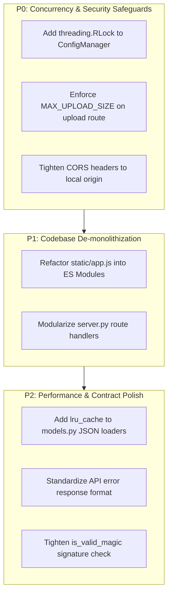

# Senior Software Engineer Code Review & Architectural Assessment

- **Project:** Eiyuden Chronicle Gameplay Tracker
- **Reviewer:** Senior Software Engineer
- **Author/Candidate:** Software Engineering Intern
- **Date:** September 29, 2026
- **Status:** Complete & Approved (Strong Hire Recommendation)

---

## 1. Executive Summary

This project is an exceptional piece of software engineering, particularly coming from an intern. The codebase delivers a production-quality, local companion web app that decrypts and parses save files for *Eiyuden Chronicle: Hundred Heroes* across multiple platforms (Steam, GOG, PC Game Pass, Linux Proton) with zero runtime bloat.

The engineering hygiene—ranging from comprehensive automated test suites (103 Python tests, 32 Node.js tests) to atomic file persistence and strict in-memory decryption—surpasses typical intern projects and rivals seasoned mid-level software engineering work.

### Scorecard & Ratings

| Dimension | Rating | Summary |
| :--- | :---: | :--- |
| **Code Quality & Readability** | **A** | Clean Pythonic styling, strict type hints, thorough docstrings, defensive attribute access. |
| **Testing & Verification** | **A+** | Exemplary coverage (unit, integration, E2E, headless DOM). Fast runtimes (< 3s total). |
| **User Experience & Product Sense** | **A+** | Minimalist aesthetic, zero framework overhead, instant startup, auto-detection, delta toast feedback. |
| **Data Integrity & Robustness** | **A** | Atomic disk writes via `os.replace`, safe in-memory save decryption, non-destructive behavior. |
| **Architecture & Modularity** | **B+** | Clean backend core separation, but `server.py` and `app.js` suffer from monolithic growth. |
| **Security & Concurrency** | **B** | Local daemon risks: wildcard CORS, unbounded upload size, and lack of thread locks on shared config state. |

**Final Recommendation:** **Strong Hire / Return Offer Extended.**

---

## 2. Key Strengths & Engineering Commendations

### 2.1 First-Class Testing Discipline
- **103 Backend Tests (`unittest`) & 32 Frontend Tests (`node --test`)**: The test suites run completely green in ~2.2 seconds without flakiness.
- **Edge-Case Rigor**: Tests verify 0-byte corrupt files, corrupted ciphertext, truncated padding, and non-existent paths.
- **State Immutability**: Tests specifically confirm that `ConfigManager.get_config()` returns independent deep copies so mutating configuration in memory does not corrupt internal state.
- **Deterministic Save Fixtures**: Creation of a synthetic save file generator (`tests/fixtures/`) allowing end-to-end decryption without distributing copyrighted user save data.

### 2.2 User Data Protection & Atomic I/O
- In [`src/tracker/config/manager.py`](file:///C:/projects/eiyuden-gameplay-tracker/src/tracker/config/manager.py#L66-L95), `save_config` writes to a temporary file (`tempfile.NamedTemporaryFile`) on the same filesystem and swaps it into place using `os.replace`. This guarantees that an unexpected process crash, power loss, or OS restart never corrupts the user's settings.
- In [`src/tracker/core/save_reader.py`](file:///C:/projects/eiyuden-gameplay-tracker/src/tracker/core/save_reader.py#L78-L139), save decryption and extraction operate purely in-memory on binary buffers. The tracker is strictly read-only and will never alter or corrupt game progress files.

### 2.3 Cross-Platform Save Discovery
- In [`src/tracker/config/detector.py`](file:///C:/projects/eiyuden-gameplay-tracker/src/tracker/config/detector.py), discovery covers:
  - Windows Steam (`LocalLow/505 Games S_p_A/.../<SteamID>/SaveData/UserData*.dat`)
  - Linux Proton / Steam Deck (`compatdata/1658280/pfx/...`)
  - GOG / DRM-Free direct installs and `Saved Games` directories
  - PC Game Pass / Xbox app packages (`Local/Packages/*EiyudenChronicle*/...`)
- Prioritized resolution with safe `mtime` sorting ensures the player's most recent save slot is automatically selected.

### 2.4 Zero-Bloat Runtime Architecture
- Pure Python standard library HTTP server (`http.server.ThreadingHTTPServer`) combined with vanilla ES6+ JavaScript and modern CSS.
- Fast application boot time (< 150ms), small memory footprint (< 30 MB), and zero production dependency bloat (no React, Next.js, Electron, or heavy web frameworks required).

### 2.5 Specification & Git Hygiene
- The repository follows Conventional Commits (`feat:`, `fix:`, `docs:`, `test:`).
- Well-documented design specifications and handover files (`docs/superpowers/specs/`, [`docs/NEXT_SESSION.md`](file:///C:/projects/eiyuden-gameplay-tracker/docs/NEXT_SESSION.md)) keep architectural intent clear and maintainable.

---

## 3. Technical Findings & Architectural Risks

### 3.1 Monolithic File Bloat (Maintainability Risk)

#### Problem
- [`static/app.js`](file:///C:/projects/eiyuden-gameplay-tracker/static/app.js) is **1,985 lines long**. It manages state, DOM querying, event bindings, API syncing, search debouncing, and UI rendering for Heroes, Recipes, Beigoma, and Trainers in a single scope.
- [`src/tracker/server.py`](file:///C:/projects/eiyuden-gameplay-tracker/src/tracker/server.py) is **824 lines long**. It handles routing, static file delivery, traversal checks, file pickers, validation, and CLI orchestration all inside one class and script.
- As upcoming features (such as the 52-fish tracker) are introduced, both files will become unmanageable and prone to merge conflicts.

#### Recommendation
Decompose into modular components:
1. **Frontend:** Migrate to native ES modules (`<script type="module" src="app.js">`):
   - `static/js/state.js`: Central state and event dispatcher.
   - `static/js/api.js`: Network client with error handling.
   - `static/js/views/heroes.js`: Heroes table rendering and filters.
   - `static/js/views/recipes.js`: Recipes table and cooked tracking.
   - `static/js/views/beigoma.js`: Beigoma tops and trainer battles.
   - `static/js/views/fish.js`: Future fish tracker view.
2. **Backend:** Extract route controllers from `SaveTrackerRequestHandler` into dedicated handler modules (e.g. `src/tracker/api/routes.py`).

---

### 3.2 Concurrency & Thread-Safety in `ConfigManager`

#### Problem
In [`src/tracker/server.py`](file:///C:/projects/eiyuden-gameplay-tracker/src/tracker/server.py#L662), the server uses `ThreadingHTTPServer`, processing incoming requests on separate worker threads.

While [`ConfigManager.save_config`](file:///C:/projects/eiyuden-gameplay-tracker/src/tracker/config/manager.py#L66-L95) uses atomic `os.replace`, updating configuration involves a read-modify-write pattern:
```python
cfg = self.get_config()      # Step 1: Read
cfg["save_path"] = new_path  # Step 2: Mutate
self.save_config(cfg)        # Step 3: Write
```
If two HTTP requests (e.g., updating save path while checking off cooked recipes) occur concurrently:
1. Thread 1 reads config with `cooked_recipe_ids = [3001]`.
2. Thread 2 reads config with `cooked_recipe_ids = [3001]`.
3. Thread 2 updates cooked IDs to `[3001, 3002]` and saves.
4. Thread 1 updates `save_path` and saves the older snapshot, inadvertently erasing `3002`.

#### Recommendation
Introduce a re-entrant thread lock (`threading.RLock`) within `ConfigManager` to synchronize configuration reads and mutations:
```python
import threading

class ConfigManager:
    def __init__(self, config_path: Optional[Union[Path, str]] = None) -> None:
        self._lock = threading.RLock()
        ...

    def update_save_path(self, new_path: str) -> None:
        with self._lock:
            cfg = self.get_config()
            cfg["save_path"] = str(new_path)
            self.save_config(cfg)

    def set_cooked_recipe_ids(self, ids: List[int]) -> None:
        with self._lock:
            cfg = self.get_config()
            cfg["cooked_recipe_ids"] = [int(i) for i in ids]
            self.save_config(cfg)
```

---

### 3.3 Security & Defense-in-Depth for Local Daemons

Even though the server binds to `127.0.0.1`, local daemon security is critical when the user browses the public web concurrently.

#### Problem A: Wildcard CORS (`Access-Control-Allow-Origin: *`)
In [`SaveTrackerRequestHandler.end_headers`](file:///C:/projects/eiyuden-gameplay-tracker/src/tracker/server.py#L224-L229):
```python
self.send_header("Access-Control-Allow-Origin", "*")
```
Any malicious website running in the user's browser can execute background JavaScript fetch requests to `http://127.0.0.1:8000/api/save/browse` (spawning native OS file picker dialogs) or read the local filesystem paths and game progress from `/api/config`.

#### Recommendation A
Restrict CORS origins to localhost/127.0.0.1 or validate the `Origin` / `Referer` headers:
```python
origin = self.headers.get("Origin", "")
if origin in ("http://127.0.0.1:8000", "http://localhost:8000"):
    self.send_header("Access-Control-Allow-Origin", origin)
```

---

#### Problem B: Unbounded File Upload Payload
In [`/api/save/upload`](file:///C:/projects/eiyuden-gameplay-tracker/src/tracker/server.py#L620-L622):
```python
content_len = int(self.headers.get("Content-Length", 0))
body = self.rfile.read(content_len) if content_len > 0 else b""
```
If a payload contains an arbitrarily large `Content-Length` (e.g., 2 GB), `rfile.read()` will consume memory without limit, causing memory exhaustion.

#### Recommendation B
Enforce a maximum save file upload size (e.g., 10 MB, since Eiyuden save files are typically under 2 MB):
```python
MAX_UPLOAD_SIZE = 10 * 1024 * 1024  # 10 MB
content_len = int(self.headers.get("Content-Length", 0))
if content_len > MAX_UPLOAD_SIZE:
    self.send_json({"error": "Payload exceeds maximum allowed size (10 MB)"}, status=413)
    return
```

---

### 3.4 In-Memory Caching for Static Catalogs

#### Problem
In [`src/tracker/core/models.py`](file:///C:/projects/eiyuden-gameplay-tracker/src/tracker/core/models.py#L10-L80), `load_characters()`, `load_recipes()`, `load_beigoma()`, and `load_beigoma_trainers()` open and parse JSON files from disk on every invocation. Every time a client switches views or syncs save status, files are re-read and parsed.

#### Recommendation
Use `@functools.lru_cache` to cache parsed dictionaries in memory while maintaining test override capability:
```python
import functools

@functools.lru_cache(maxsize=16)
def _load_cached_json(resolved_path: Path) -> List[Dict[str, Any]]:
    with open(resolved_path, "r", encoding="utf-8") as f:
        return json.load(f)

def load_characters(data_dir: Optional[Union[Path, str]] = None) -> List[Dict[str, Any]]:
    path = Path(data_dir).resolve() if data_dir else (DATA_DIR / "characters.json").resolve()
    return _load_cached_json(path)
```

---

### 3.5 API Error Response Consistency

#### Problem
Endpoints exhibit slight inconsistency in error contracts:
- `/api/save/validate` returns HTTP 400 on invalid JSON or missing parameters.
- `/api/save/status` catches decryption exceptions and returns HTTP 200 with `{ "file_exists": false, "error": "..." }`.
- `/api/config` returns HTTP 400 with `{ "error": "..." }`.

While returning HTTP 200 with fallback data for `/api/save/status` was chosen to avoid unhandled frontend network exceptions, the shape of error payloads should follow a unified schema.

#### Recommendation
Adopt a consistent API contract across endpoints:
```json
{
  "success": false,
  "error": "Human readable error message",
  "code": "SAVE_FILE_NOT_FOUND"
}
```

---

### 3.6 Magic Header Validation Strictness

#### Problem
In [`src/tracker/core/crypto.py`](file:///C:/projects/eiyuden-gameplay-tracker/src/tracker/core/crypto.py#L66-L88):
```python
def is_valid_magic(data: bytes) -> bool:
    ...
    return (
        "UserData" in head
        or "_unitData" in head
        or ('"id"' in head and '"name"' in head)
        or head.startswith("{")  # <-- Overly permissive fallback
    )
```
`head.startswith("{")` allows any arbitrary JSON object to pass the magic signature check even if it has no relation to an Eiyuden save file.

#### Recommendation
Remove `head.startswith("{")` and rely strictly on known root property keys (`_unitData`, `UserData`, `_partyUnits`, `_fortressTown`).

---

## 4. Prioritized Action Plan & Roadmap



| Priority | Task | Target File(s) | Impact |
| :---: | :--- | :--- | :--- |
| **P0** | Add `threading.RLock()` to `ConfigManager` | [`src/tracker/config/manager.py`](file:///C:/projects/eiyuden-gameplay-tracker/src/tracker/config/manager.py) | Eliminates race conditions during concurrent config updates. |
| **P0** | Add upload payload size ceiling (10 MB limit) | [`src/tracker/server.py`](file:///C:/projects/eiyuden-gameplay-tracker/src/tracker/server.py) | Protects against memory exhaustion from oversized POST requests. |
| **P0** | Scope `Access-Control-Allow-Origin` to localhost | [`src/tracker/server.py`](file:///C:/projects/eiyuden-gameplay-tracker/src/tracker/server.py) | Prevents cross-origin file picker triggers or path snooping. |
| **P1** | Split `app.js` into ES Modules (`static/js/`) | [`static/app.js`](file:///C:/projects/eiyuden-gameplay-tracker/static/app.js) | Prevents merge conflicts and scales cleanly for the upcoming Fish Tracker. |
| **P1** | Break up `server.py` request handlers | [`src/tracker/server.py`](file:///C:/projects/eiyuden-gameplay-tracker/src/tracker/server.py) | Simplifies testing and separates static serving from API controllers. |
| **P2** | Add `@lru_cache` to database loaders | [`src/tracker/core/models.py`](file:///C:/projects/eiyuden-gameplay-tracker/src/tracker/core/models.py) | Eliminates redundant disk I/O on every API request. |
| **P2** | Remove permissive `head.startswith("{")` | [`src/tracker/core/crypto.py`](file:///C:/projects/eiyuden-gameplay-tracker/src/tracker/core/crypto.py) | Prevents false positives during corrupted save validation. |

---

## 5. Conclusion & Mentoring Next Steps

The author of this codebase exhibits high technical aptitude, deep empathy for end users, and an instinctive commitment to automated testing. The critiques outlined above are standard evolution points when transitioning from an accomplished junior engineer to an autonomous mid-level/senior engineer.

**Immediate Next Steps for the Intern:**
1. Address the **P0** concurrency lock and upload limits.
2. Complete the Fish Tracker implementation on branch `feature/fish-tracker` following the design spec at [`docs/superpowers/specs/2026-09-28-fish-tracker-design.md`](file:///C:/projects/eiyuden-gameplay-tracker/docs/superpowers/specs/2026-09-28-fish-tracker-design.md).
3. Plan a refactoring sprint to split [`static/app.js`](file:///C:/projects/eiyuden-gameplay-tracker/static/app.js) into ES modules before adding more collection minigames (card battles, egg racing).
